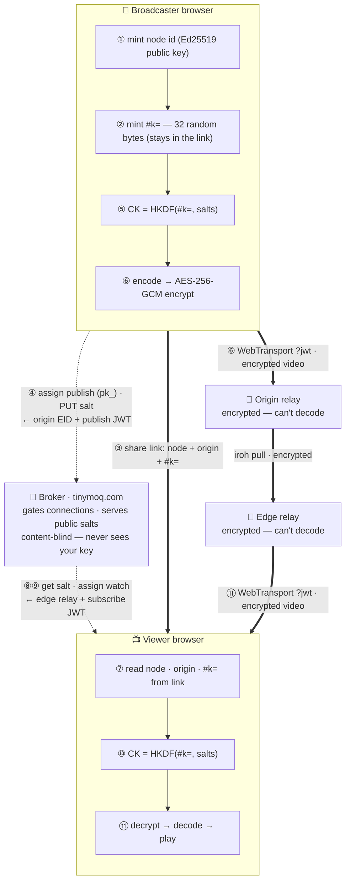

# Earthseed

**Private live streaming, with maximum privacy protection.** It runs entirely in your browser —
no app to install. Your video is **encrypted on your device** before it leaves, so the relay that
carries it **can't decode it**, and the broker that connects you to a relay **never touches your
video** and keeps no record of your stream's content. No accounts. No server-side list of who's
streaming.

Live at **[earthseed.live](https://earthseed.live)**.

- **The app:** [`simple/`](simple/) — this is what earthseed.live serves.
- **Read it:** [`simple/earthseed.js`](simple/earthseed.js) — our entire client, one unminified file.
- **Trust model:** [`simple/TRUST.md`](simple/TRUST.md) · **client README:** [`simple/README.md`](simple/README.md)

## How a stream travels — and what's exchanged

Two browsers, one broker, a relay fleet. Follow the numbers. The **content key lives only in the
share link** and is derived on each device — nothing in the middle can decrypt your video.

Dotted lines are the **control plane** (talking to the broker); thick lines are the **data plane**
(your encrypted media). Only the two browsers ever hold `CK`.

- **End-to-end encryption.** Each broadcast's key is derived in the browser (`HKDF-SHA256` over a
  random value that lives only in the `#…` fragment of the share link, plus public salts). Media is
  `AES-256-GCM` per encoded chunk — **audio and video**. No relay or broker ever sees the key.
- **The relay can't decode it.** Media rides plain WebTransport/QUIC through a relay fleet that only
  ever handles encrypted data; the catalog (codec/resolution) is the only thing in the clear.
- **The broker only connects you.** It assigns a nearby relay and issues a short-lived, per-broadcast
  token — your video never passes through it, and it stores nothing about your stream's content.
- **No accounts, no directory.** The stream's identity is a public key; there's no login and no
  server-side list of streams. A stream is reachable only to someone who has its share link.

## The values being exchanged

Everything in the path is one of these. Only one of them is a secret.

| Value | Secret? | What it is |
|---|---|---|
| `pk_…` | No | **Publishable key.** Identifies a tenant for quota/limits; can mint relay tokens but **can't decrypt**. Ships in the page. |
| `node id` | No | An **Ed25519 public key** (base32). The stream's identity and the relay track name. |
| `origin EID` | No | Which relay holds the origin, so a viewer's edge knows where to pull from. Routing only. |
| `salts` + `epoch` | No | Public **HKDF inputs** (a global kill-switch salt ‖ a per-stream salt). Rotating one re-keys the stream. |
| `JWT` | Short-lived | A per-broadcast relay token authorizing the **connection** (publish or subscribe scope). Not a content key. |
| `#k=` → `CK` | **Yes** | **The secret.** 32 bytes in the link fragment (never sent to a server) → the `AES-256-GCM` key via HKDF. Held only by the two browsers. |

## Who can see what

The design makes every party in the middle either content-blind or removable.

| Party | Can see | Never sees |
|---|---|---|
| **Broker** (tinymoq.com) | node id, tenant `pk_`, public salts, coarse geo; mints tokens | your `#k=`, the key `CK`, your video &amp; audio |
| **Relay fleet** | a connection token, encrypted (unreadable) frames, the catalog (codec/resolution) | your `#k=`, the key `CK`, your video &amp; audio |
| **Someone with the link** | everything — the link carries `#k=` | — (share it carefully) |
| **Someone without the link** | at most scrambled, unreadable data | anything decryptable |

## Small enough to read

Each page loads exactly two pieces of JavaScript, on purpose:

- **Our whole client** — [`simple/earthseed.js`](simple/earthseed.js): one unminified, documented ES
  module that runs in the browser **as-is (no build step)**. It does capture, encode, **encrypt**,
  decrypt, decode and render. What you read is what runs.
- **The transport** — [`@moq/net`](https://www.npmjs.com/package/@moq/net/v/0.1.5) (Media over QUIC),
  loaded **directly from its published package at a pinned version** via an import map. Not vendored,
  not modified — verify it upstream.

No bundler, no analytics, no external scripts.

## Use it

1. Open **`broadcast.html`**, allow the camera + mic, press **Go live**.
2. Press **Copy viewer link** and send it to whoever should watch.
3. They open it in **`watch.html`** — no account, no password.

The share link is `watch.html?node=<id>&o=<origin>#k=<key>`. The part after `#` is the content key;
browsers never send a URL fragment to a server, so **only someone with the whole link can decrypt**.

Works on recent **Chrome/Edge** and **Safari on iOS 18+ / macOS** (needs WebTransport + WebCodecs).
Audio starts muted — tap to unmute.

## Host it yourself

It's static — put `simple/earthseed.js` + `broadcast.html` + `watch.html` on any HTTPS host. Two modes:

- **Broker mode (default):** a gated relay + short-lived token from the broker. Set your own public
  key with `<meta name="earthseed-key" content="pk_…">` (it's public — safe to ship).
- **Open-relay mode:** add `?relay=https://your.relay/` to `broadcast.html` — no broker; any open MoQ
  relay. Still end-to-end encrypted. Zero backend, great for a review.

Typecheck the client (no build needed): `npx tsc --noEmit -p simple/tsconfig.json`.

## Privacy, honestly

The design makes every party in the middle either **content-blind** or **removable** — but it
doesn't pretend the limits away:

- Any relay you connect to sees your **IP** (true of any website). It isn't stored; put a **VPN or
  Tor** in front to hide it — the encryption is unchanged.
- A share link is only as private as **how you share it** — the `#…` key never reaches a server, but
  whoever you send it to (and your browser history) has it.
- **Not DRM:** an authorized viewer can still capture decoded frames.
- "Read exactly what runs" is a goal, not a proof — the client is unminified and unbundled so it's
  readable, but verifying the *hosted* bytes is on you (or self-host).

Full detail — what each party can and cannot see — is in [`simple/TRUST.md`](simple/TRUST.md).

## License

MIT — see [LICENSE](LICENSE).
