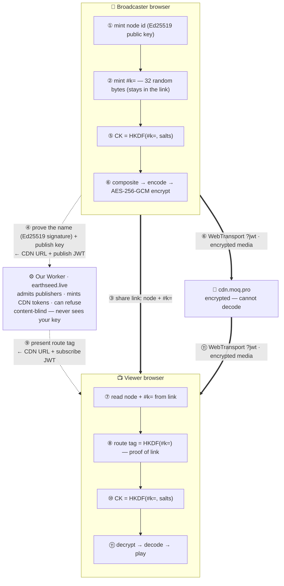

# Earthseed

**Live streaming where the infrastructure cannot watch.** It runs entirely in your browser — no app
to install. Your video and audio are **encrypted on your device** before they leave, so the CDN that
carries them **cannot decode them**, and the key lives only in the share link. Chat is encrypted the
same way, under a key derived from the same link.

Live at **[earthseed.live](https://earthseed.live)**.

- **The app:** [`simple/`](simple/) — this is what earthseed.live serves, with no build step.
- **Trust model:** [`simple/TRUST.md`](simple/TRUST.md) — what each party can and cannot see.
- **What is published:** [`INTEGRITY.md`](INTEGRITY.md) — SHA-256 of every file the client runs.

## What it knows about you

- **There is no sign-in.** Broadcasting is admitted by a *publish key*: a capability with an expiry
  inside it, under a MAC only our Worker can produce, never written down.
  [Requesting one](https://earthseed.live/request) asks you for nothing.
- **An accounts tier exists in the Worker, and it is switched off.** Google OAuth, a `users` table
  and a `broadcaster_access` allow list live in `src/worker/auth/`. They are inert while `ACCOUNTS`
  is `"off"` in [`wrangler.jsonc`](wrangler.jsonc): `/api/auth/*` refuses everything and nothing can
  be written to `users`. `curl -s https://earthseed.live/api/config` reports `"accounts"`, so the
  claim is checkable rather than asserted. Turned on, a signed-in allowed address can publish
  without a key — and we then know who broadcast.
- **There is a server-side record of broadcast names.** `broadcasts` holds that a name went live and
  when it stopped; `watch_events` holds viewing sessions against a salted hash with no identity in
  it; `streams` holds each broadcast's own settings. It is the price of being able to stop a stream.
  None of it can be tied to a person by us: there is no account, and the publish key that admitted
  you is not stored. What is absent is **who**, not **what**.
- **Seeds keeps a persistent row per vault.** See [Seeds](#seeds-a-demo) — it is a demo, nothing in
  it moves money, and the cash-out path is deliberately unfinished.

None of that touches the encryption. The `#k=` fragment never reaches any server, and nothing in the
middle can decrypt a frame.

## How a stream travels

Two browsers, one Worker, one CDN. The **content key lives only in the share link** and is derived
on each device.



Dotted lines are the **control plane**; thick lines are the **data plane**. Only the two browsers
ever hold `CK`.

Salts reach a viewer **in band**, on the broadcaster's own catalog track — so after being placed, a
viewer never talks to us again. They are public HKDF inputs and decrypt nothing alone.

### Where the media goes

Through **[moq.pro](https://moq.pro)**, a CDN we do not operate. Our Worker mints a per-broadcast
**Ed25519 (`EdDSA`) JWT** naming an account root and exactly one broadcast path beneath it, with an
expiry. moq.pro holds only the public half: it can verify a token and cannot forge one.

A relay never holds a content key, so which company runs it is not what protects your media — it
only ever carries ciphertext. Two things follow from it being shared infrastructure: broadcasts are
not separated by a machine boundary, and what scopes a compromise is token scope, a token naming one
broadcast path and nothing else. The Worker also supports placing streams on a self-run relay fleet,
which is the route for anyone self-hosting who wants that boundary back.

## The values being exchanged

Everything in the path is one of these. Only two of them are secrets.

| Value | Secret? | What it is |
|---|---|---|
| `publish key` | Sort of | **Admits you to broadcast.** A capability carrying its own expiry under a MAC only our Worker can produce. Never stored, so it links you to nothing. **Cannot decrypt.** |
| `route tag` | No | **Proof you hold the link.** `HKDF(#k=)` under a different salt *and* a different info string than the content key, so it is cryptographically independent of it. **Decrypts nothing.** |
| `node id` | No | An **Ed25519 public key** (base32). The broadcast's identity, its track name, and what a settings write is signed against. |
| `salts` + `epoch` | No | Public **HKDF inputs** (a global kill-switch salt ‖ a per-stream salt). Rotating one re-keys the stream. |
| `JWT` | Short-lived | A per-broadcast CDN token authorizing the **connection** (publish or subscribe scope). Not a content key. |
| `link_enc` | Opaque | A sealed blob a broadcaster may store against their own stream, encrypted under a key derived from `#k=`. Meaningless to us. |
| `#k=` → `CK` | **Yes** | **The secret.** 32 bytes in the link fragment (never sent to a server) → the `AES-256-GCM` key via HKDF. Held only by the two browsers. |
| `passcode` | **Yes** | **Optional second secret.** Deliberately **not in the link** — spoken or texted, stretched with PBKDF2 and mixed into `CK`. Never sent to or checked by any server. |

## Who can see what

| Party | Can see | Never sees |
|---|---|---|
| **Our Worker** | that a broadcast started and ended, its name, its route tag, its settings, counts of viewing sessions, chat *ciphertext* | your `#k=`, the key `CK`, your passcode, your media, your chat, who you are |
| **cdn.moq.pro** | a connection token, encrypted frames, the catalog (codec/resolution), your IP | your `#k=`, the key `CK`, your media |
| **Someone with the link** | your video, audio and chat — the link carries `#k=`, so anyone with it can watch (share it carefully) | cannot publish as you, rewrite your settings, or rotate your key |
| **Someone without the link** | at most encrypted frames, the cleartext catalog, and traffic size/timing | nothing decryptable |

## What runs in your browser

No bundler, no build step, no analytics, and **no script from any third-party origin at runtime** —
enforced by a `Content-Security-Policy` that permits only this origin, with each inline block pinned
by SHA-256 and `require-trusted-types-for 'script'; trusted-types 'none'` on top.

**13 files, about 7,600 lines**, all unminified and documented, each reached by a dynamic import so
a page only fetches what it uses — a watch page with no chat and no overlay loads three of them.

| File | Lines | What it is |
|---|---|---|
| [`earthseed.js`](simple/earthseed.js) | 3,207 | capture, encode, **encrypt**, publish, subscribe, **decrypt**, decode, render — and every page controller |
| [`compositor.js`](simple/compositor.js) | 1,098 | camera + screen + mic into one canvas and one audio mix; the burn-ins are drawn here |
| [`seeds.js`](simple/seeds.js) · [`seeds-recovery.js`](simple/seeds-recovery.js) | 1,110 | the seeds demo and its 256-word recovery phrase |
| [`qr.js`](simple/qr.js) | 533 | a QR encoder, so a link on screen is encoded here and not by a third party |
| [`overlay.js`](simple/overlay.js) · [`overlay-editor.js`](simple/overlay-editor.js) | 551 | the broadcaster's panel: typed blocks built as DOM, never parsed from markup |
| [`chat.js`](simple/chat.js) | 251 | end-to-end encrypted chat |
| [`geo-stamp.js`](simple/geo-stamp.js) · [`edge-clock.js`](simple/edge-clock.js) · [`nearest-city.js`](simple/nearest-city.js) | 644 | the optional location and time burn-in, and the clock it trusts instead of yours |
| [`offline-notice.js`](simple/offline-notice.js) · [`audio-capture-worklet.js`](simple/audio-capture-worklet.js) | 182 | the shutter notice; Safari's PCM capture path |

The transport is **[`@moq/net`](https://www.npmjs.com/package/@moq/net/v/0.1.5)** (Media over QUIC)
by [Luke Curley](https://github.com/kixelated) — unmodified but **vendored** to
[`simple/vendor/`](simple/vendor/) and served from our own origin, because fetching it from a CDN
would put a third party in a position to replace code running on the same page as your content key.
[`simple/vendor/README.md`](simple/vendor/README.md) has the build command, the SHA-256 and the
resolved dependency table, so you can reproduce it byte-for-byte.

**"Read exactly what runs" is a goal, not a proof.** [`INTEGRITY.md`](INTEGRITY.md) is what it rests
on: the hash of every file above, committed to git, so the record lives somewhere other than the
site being checked. `npm run verify` compares the live site against it.

## Use it

1. [**Request a publish key**](https://earthseed.live/request) — free, about a minute, and it asks
   you for nothing. Broadcasting needs one; watching never does.
2. Open **`broadcast.html`**, switch on **Camera**, **Mic** and **Screen** in any combination, and
   press **Go live**.
3. Press **Copy viewer link** and send it to whoever should watch.
4. They open it in **`watch.html`** — no account, no password.

The share link is `watch.html?node=<id>#k=<key>`. The part after `#` is the content key; browsers
never send a URL fragment to a server, so **only someone with the whole link can decrypt**.

Works on recent **Chrome/Edge** and **Safari on iOS 18+ / macOS** (needs WebTransport + WebCodecs).
Audio starts muted — tap to unmute.

### What a broadcaster can turn on

- **Camera, microphone and screen, combinable.** Camera over a screen share puts the camera in an
  inset you can drag and resize. All of it goes out as **one video track and one audio track for the
  whole session**, so changing sources mid-broadcast never drops a viewer.
- **A passcode** — a second secret kept out of the link, mixed into the key, never sent anywhere.
- **Live chat**, end-to-end encrypted under a key derived from the same `#k=` through a different
  HKDF info string. The Durable Object that relays it stores a blob it cannot read — which also
  means there is no server-side moderation of chat, because there is nothing there to moderate.
- **A panel under the video** — headings, text, lists, links, images, a cross-origin embed. Stored
  as typed blocks, never as markup, and built with `createElement`/`textContent` in the viewer's
  page. There is no string-to-DOM route in this origin to sanitise.
- **Burn-ins**, all off by default and all drawn *into* the picture so they survive a screen
  recording and travel inside the encryption: a **handle watermark**, a **QR code** for a link
  (encoded in your browser, so nothing is told which link you put on screen), and a **location and
  time stamp**. That last one points the opposite way from everything else here — it puts your
  coordinates in the picture for everyone holding the link. It is not proof of anything; it raises
  the cost of a casual lie. The UTC it burns in comes from our edge rather than your computer's
  clock, so a viewer can compare it with their own and read the delay off the screen.

## Seeds, a demo

**Where to find it:** a floating `🌻` pill in the bottom-right corner of
[`broadcast.html`](https://earthseed.live/broadcast.html) and any watch page. It is deliberately not
on the landing page — that page loads none of this client — and it disables itself entirely unless
the Worker answers `GET /api/seeds/vault?pubkey=probe` with a 404, so a deployment without the demo
shows nothing rather than a pill that opens onto an error.

`simple/seeds.js` and `src/worker/seeds.ts` implement a tipping and prepaid-bandwidth economy: four
pools per vault (free, gifted, paid, earned), a ledger, and per-stream accrual. A vault is addressed
by a public id derived from a 256-word recovery phrase that never leaves the browser, and authorised
by the other half of the same derivation.

**Nothing in it moves money.** There is no payment processor. "Buying" a packet credits a vault
directly; a cash-out records an intent and stops. Every figure on those screens is arithmetically
correct and none of them moved a cent. The cash-out path is an unresolved *legal* question, not an
engineering one, and it must be answered before any of this is connected to a processor. Read that
as a blocker, not a to-do.

It is also the one persistent per-person row in this database. Migration
[`0014_seeds.sql`](src/worker/db/migrations/0014_seeds.sql) says so at length, including what it
costs the privacy claim everything else here is built on.

## Moderation, and what it costs

We cannot see what anyone broadcasts, so we cannot police content — and do not pretend to review it.
What we can do is **stop** a stream. Any viewer can report one from the watch page, sending the
stream's name and nothing about themselves; an operator reads the queue and decides. Nothing is
automatic, because "enough reports" would be a weapon aimed at exactly the people this exists to
protect.

Terminating means no further placement and no further token for that name. Browsers running our
client stop within about five seconds. A session already open ends when its CDN token expires and is
not reissued. We still cannot say what a terminated stream contained.

## Host it yourself

The client is static, and `npm run bundle` packages it. A full self-host also means running the
Worker in `src/worker/`, because the client asks **its own origin** for placement rather than a
relay broker directly.

That is what publisher admission and a working kill switch cost: both need someone in a position to
decline, and there is no such position in a page that talks straight to a relay. The encryption is
untouched by it — the Worker sees names, tags and capabilities, never media, and the `#k=` fragment
never reaches any server.

```sh
npm run typecheck     # no build needed
npm run check         # CSP hashes + INTEGRITY.md, the gate on deploy
npm run verify        # compare the live site against INTEGRITY.md
```

End-to-end suites run against a **deployed** origin, because there is no local build:

| Command | What it proves |
|---|---|
| `npm run e2e` | the control plane, and that no publish key means nothing is transmitted |
| `npm run e2e:media` | a real broadcast watched end to end, with the pixels sampled, viewing counted and chat proved encrypted |
| `npm run e2e:compositor` | camera + screen composited, in pixels, with the published track never changing |
| `npm run e2e:burnins` | the QR read back **out of the composited frame** and decoded; the two location shapes kept distinguishable |
| `npm run e2e:overlay` | the renderer refuses what it says it refuses, and the editor round-trips |
| `npm run e2e:qr` | every symbol decodes back to its own input, Reed-Solomon check and all |
| `npm run e2e:camera` | a camera taken away by the OS, and a front/back flip that does not end the broadcast |
| `npm run e2e:seeds` | the four pools, the gate, a purchase that moves the balance, and the recovery phrase |
| `npm run e2e:ui` | the page chrome |

Most take an origin as their first argument and serve `simple/` themselves without one. **The run
that counts is against a deployed origin**: served locally there is no `_headers`, so Trusted Types
is not enforced and the constraint several of these are built around is simply absent.

## Privacy, honestly

- Any relay you connect to sees your **IP** (true of any website). Put a **VPN or Tor** in front to
  hide it — the encryption is unchanged.
- A share link is only as private as **how you share it**. The `#…` key never reaches a server, but
  whoever you send it to — and your browser history — has it.
- **Not DRM:** an authorized viewer can still capture decoded frames.
- We know **that** a broadcast happened, when, its name, and roughly how many people watched. That
  is the price of being able to stop one. We do not know who you are.
- **A passcode gates decryption, not connection.** Someone with your link can pull ciphertext and
  attack the passcode offline. Closing that would mean our Worker verifying passcode knowledge,
  which would hand it an offline-guessing oracle and destroy the property the passcode exists for.
  The slow KDF is what makes the trade safe.
- **Hostile code on the page beats all of this.** Anyone who can run script in your tab reads the
  content key out of the fragment. The CSP and the vendored transport narrow how such code gets
  there; neither makes the page safe to lose.

Full detail is in [`simple/TRUST.md`](simple/TRUST.md).

## License

MIT — see [LICENSE](LICENSE).
